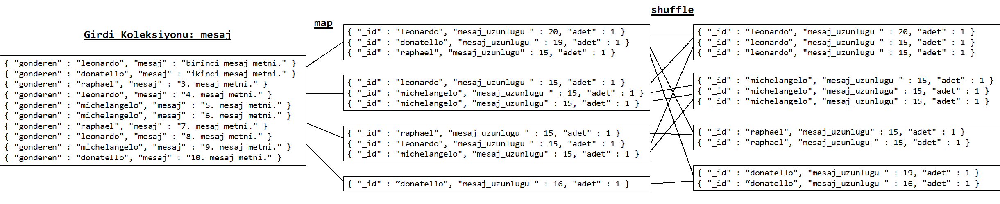
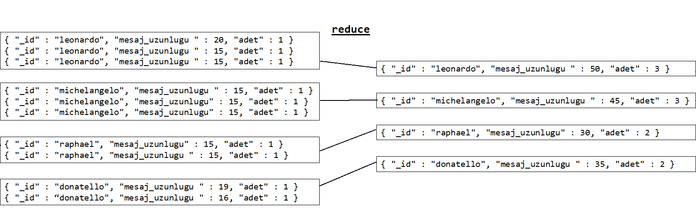
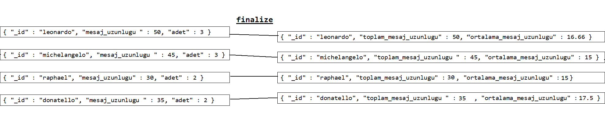
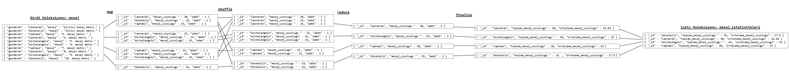

# MapReduce Kavramı ve MongoDB Üzerinde Uygulaması

Bu yazının amacı MapReduce kavramını tanıtmak ve bu kavramın MongoDB üzerinde bir uygulamasını göstermektir.

MapReduce büyük veri kümelerinde paralel işlem yapabilmek için [Google] tarafından geliştirilmiş bir programlama modelidir. Temelde iki aşamadan oluşur, `map` ve `reduce`. `map` aşamasında yığınlara ayrılmış her bir veri yığını (`chunk`) paralel olarak bir işlemden (`mapper`) geçer, bu işlem sonucunda anahtar-değer (key-value) ikilileri oluşur. Sonra `shuffle` aşamasında aynı anahtara sahip olan anahtar-değer ikilileri bir araya toplanır. Bu anahtar-değer ikilileri `reduce` aşamasına gelir ve burada da her anahtara ait veriler paralel olarak işlenir (`reducer`) ve tek bir veriye indirgenir. `map` ve `reduce` aşamalarından sonra istenirse `reduce` işleminden geçmiş veriler `finalize` işlemine sokulur. Sonrasında elde edilen tüm `reduce` edilmiş değerler doğrudan bir programa döndürülür / tabloya yazılır / koleksiyona yazılır.

### Örnek: Kim Ne Kadar Konuşmuş

Örneğin elimizde aşağıdaki gibi bir mesaj koleksiyonu olsun, bu koleksiyondaki alanlar `_id`, `gonderen` ve `mesaj`.

```js
{ "_id" : ObjectId("5b9d5963db0f80b74746ac17"), "gonderen" : "leonardo", "mesaj" : "birinci mesaj metni." }
{ "_id" : ObjectId("5b9d5970db0f80b74746ac18"), "gonderen" : "donatello", "mesaj" : "ikinci mesaj metni." }
{ "_id" : ObjectId("5b9d597bdb0f80b74746ac19"), "gonderen" : "raphael", "mesaj" : "3. mesaj metni." }
{ "_id" : ObjectId("5b9d597fdb0f80b74746ac1a"), "gonderen" : "leonardo", "mesaj" : "4. mesaj metni." }
{ "_id" : ObjectId("5b9d5988db0f80b74746ac1b"), "gonderen" : "michelangelo", "mesaj" : "5. mesaj metni." }
{ "_id" : ObjectId("5b9d598cdb0f80b74746ac1c"), "gonderen" : "michelangelo", "mesaj" : "6. mesaj metni." }
{ "_id" : ObjectId("5b9d5994db0f80b74746ac1d"), "gonderen" : "raphael", "mesaj" : "7. mesaj metni." }
{ "_id" : ObjectId("5b9d599cdb0f80b74746ac1e"), "gonderen" : "leonardo", "mesaj" : "8. mesaj metni." }
{ "_id" : ObjectId("5b9d59a5db0f80b74746ac1f"), "gonderen" : "michelangelo", "mesaj" : "9. mesaj metni." }
{ "_id" : ObjectId("5b9d59afdb0f80b74746ac20"), "gonderen" : "donatello", "mesaj" : "10. mesaj metni." }
```

Amacımız bu koleksiyondaki mesajları MapReduce tekniği ile işleyip hangi kişinin ne kadar konuştuğunu ve mesaj başına kaç karakter kullandığını bulmak. Burada her kişi için 2 bilgiye ihtiyacımız var, toplam kaç karakter kullandığı ve toplam kaç mesaj gönderdiği.

`map` aşamasında verilerden anahtar-değer ikilileri oluşturuyorduk. Buradaki anahtarımız `gonderen` olacak, değerimiz ise `mesaj_uzunlugu` ve `adet` olacak. Örneğin `mapper` işleminden geçtikten sonra leonardo için veriler şu şekilde olacak.

```js
{ "_id" : "leonardo", { "mesaj_uzunlugu" : 20, "adet" : 1 } }
{ "_id" : "leonardo", { "mesaj_uzunlugu" : 15, "adet" : 1 } }
{ "_id" : "leonardo", { "mesaj_uzunlugu" : 15, "adet" : 1 } }
```

`reduce` aşamasına gelen her anahtar için kendi içinde bir indirgeme gerçekleşecek. Burada mesaj uzunluğu ve adet değerleri toplanarak map aşamasına gelen değer sayısı tek bir değere indirilecek. Reducer işleminden geçtikten sonra değerler şu hali alacak.

```js
{ "_id" : "leonardo", { "mesaj_uzunlugu" : 50, "adet" : 3 } }
```

Son olarak `finalize` aşamasında ortalama karakter sayısını bularak işi bitireceğiz. Buradan çıkan sonuçta da leonardo için durum şöyle olacak.

```js
{ "_id" : "leonardo", { "mesaj_uzunlugu" : 50, "ortalama_mesaj_uzunlugu" : 16.666666666666668 } }
```

Şimdi bu işleri MongoDB üzerinde nasıl kodlarız ona bakalım.

## `mapper` Fonksiyonu

```js
var mapper = function() {
    emit(this.gonderen, { mesaj_uzunlugu: this.mesaj.length, adet: 1 });
}
```

Bu fonksiyon, koleksiyondaki her bir doküman için çalışır ve içerideki `emit` fonksiyonu sayesinde her doküman için anahtar-değer ikilisi oluşturur. `map` aşamasından sonra MongoDB otomatik olarak `shuffle` aşaması ile aynı anahtarları bir arada toplar.


## `reducer` Fonksiyonu

```js
var reducer = function(key, values) {
    var result = { "mesaj_uzunlugu" : values[0].mesaj_uzunlugu, "adet" : values[0].adet };
    for (var i = 1; i < values.length; i++) {
        result.mesaj_uzunlugu += values[i].mesaj_uzunlugu;
        result.adet += values[i].adet;
    }
    return result;
}
```

Bu fonksiyona gelen `key` parametresi `emit` edilen anahtarı, `values` parametresi `emit` edilen değerlerin bir dizisini temsil eder. leonardo için bu değerler şöyledir.

```
key: leonardo
values: [ { "mesaj_uzunlugu" : 20, "adet" : 1 }, { "mesaj_uzunlugu" : 15, "adet" : 1 }, { "mesaj_uzunlugu" : 15, "adet" : 1 } ]
```

`reducer` fonksiyonu aynı anahtar için birden fazla çağrılabilir. Örneğin aynı anahtara sahip olan 100 tane veri vardır, reducer fonksiyonu 50'si için bir kere çağrılır, sonra diğer 50'si için de bir kere çağrılır, sonra bunlardan çıkan sonuçları tekrar reduce etmek için bir kere daha çağrılır. O yüzden yazdığınız `reducer` fonksiyonları tekrar çağrılma durumlarına karşı adaptif olmalıdır. Örneğin burada adet değişkeninde toplama işlemi yaparken `values[i].adet` eklemek yerine direkt olarak 1 ekleseydik `reducer` fonksiyon 1 kere çağrıldığı anahtarlar için doğru sonucu üretirken, birden fazla çağrıldığı anahtarlar için yanlış sonucu üretecektir. Bunun yanında `reducer`'ın ürettiği çıktılar `mapper` tarafından oluşturulup gönderilen girdinin formatı ile aynı olmalıdır, çünkü `reducer` birden fazla çağrıldığında aynı çıktı tekrardan girdi olarak da kullanılabilir.


## `finalizer` Fonksiyonu

```js
var finalizer = function(key, reducedValue) {
    return { "toplam_mesaj_uzunlugu" : reducedValue.mesaj_uzunlugu, "ortalama_mesaj_uzunlugu" : reducedValue.mesaj_uzunlugu / reducedValue.adet };
}
```

Bu fonksiyondaki `reducedValue` parametresi `reducer` fonksiyonu tarafından üretilen çıktıdır. `finalizer` fonksiyonu 1 kere çağrıldığı için üretilen çıktı buradaki gibi girdiden farklı bir formatta olabilir, adaptif olması gereken herhangi bir durum yoktur.


## MapReduce Sorgusunun Çalıştırılması

```js
db.mesaj.mapReduce(mapper, reducer, { finalize: finalizer, out: "mesaj_istatistikleri" });
```

Bu işlemin çıktısını `db.mesaj_istatistikleri.find()` ile listelersek aşağıdaki gibi olacaktır:

```js
{ "_id" : "donatello", "value" : { "toplam_mesaj_uzunlugu" : 35, "ortalama_mesaj_uzunlugu" : 17.5 } }
{ "_id" : "leonardo", "value" : { "toplam_mesaj_uzunlugu" : 50, "ortalama_mesaj_uzunlugu" : 16.666666666666668 } }
{ "_id" : "michelangelo", "value" : { "toplam_mesaj_uzunlugu" : 45, "ortalama_mesaj_uzunlugu" : 15 } }
{ "_id" : "raphael", "value" : { "toplam_mesaj_uzunlugu" : 30, "ortalama_mesaj_uzunlugu" : 15 } }
```

Buradaki `mapReduce` fonksiyonu 3 parametre alır: `mapFunction`, `reduceFunction`, `options`.

Burada çalıştırdığımız fonksiyonda `options` kısmı için kullandığımız `finalize` parametresi ile `finalizer` fonksiyonunun ne olduğunu gösteriyoruz. `out` parametresi ise sonucun yazdırılacağı koleksiyonun ismini belirler. Bu parametreye `{ inline : 1 }` değerini atarsanız sonuç bir koleksiyona yazdırılmadan doğrudan geri döner, bu bir koleksiyona yazdırma işleminden çok daha hızlı bir şekilde sonucu elde etmenizi sağlar, ancak büyük boyutlu işlemlerde hafıza yetmeyeceği için fonksiyon hata verecektir ve sizden sonucu bir koleksiyona yazdırarak fonksiyonu çalıştırmanızı isteyecektir. Bunun dışında faydalı olabilecek `scope` isimli bir parametre ile bu fonksiyonlarda kullanmak istediğiniz global değişkenleri tanımlayabilirsiniz. Ancak `scope` kullanırken dikkat etmeniz gereken şey `scope`'un paylaşılan bir değişken olmadığıdır. Yani paralel çalışan işlemlerde -ki MapReduce'ün uygulandığı tüm işlemlerdeki amaç işi paralleştirerek performans kazanmaktır- `scope`'tan gönderdiğiniz değişkenin değerini değiştirdiğiniz durumda diğer shard'ların yeni değerden haberi olmaz. Buradan gönderdiğiniz değerler sabit değerler olmalı. Bu fonksiyonların detayları ve özellikle de gerektirdiği şartlar ile ilgili dokümantasyon [sayfasını] kesinlikle okumalısınız ve çok iyi bilmelisiniz.

## MapReduce Örneğindeki Tüm Veri Akışı



## Sonuç

Bu yazıda genel olarak MapReduce kavramına ve bunun MongoDB'de nasıl uygulanabileceğine dair bir giriş yapıldı.

[Google]: https://storage.googleapis.com/pub-tools-public-publication-data/pdf/16cb30b4b92fd4989b8619a61752a2387c6dd474.pdf
[sayfasını]: https://docs.mongodb.com/manual/reference/command/mapReduce/
